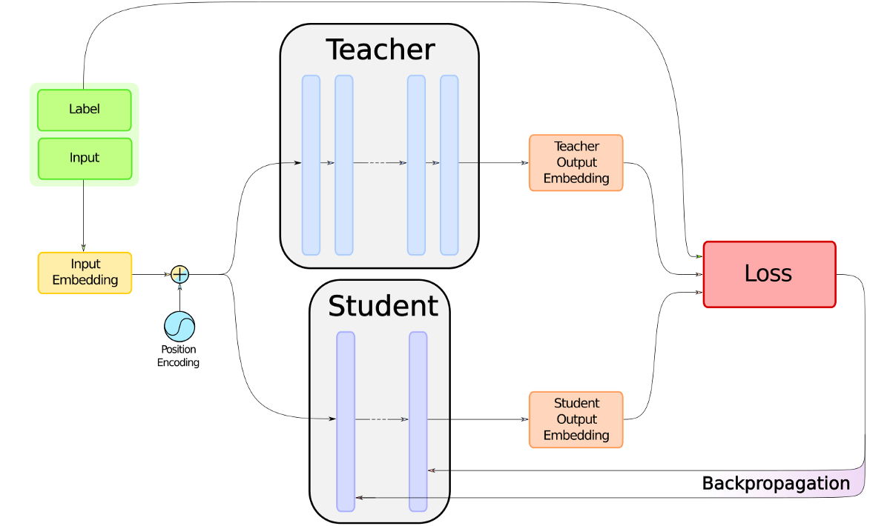
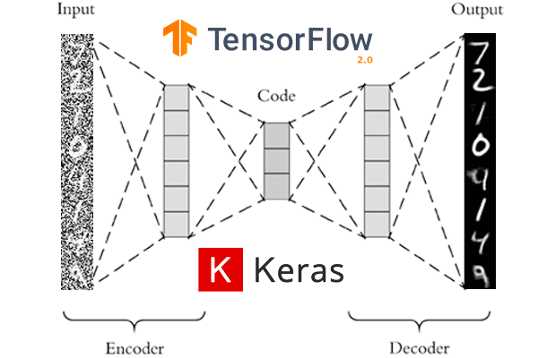
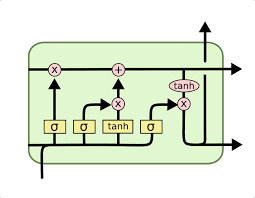

<!-- ---
layout: default
title: Welcome
---

Text can be **bold**, _italic_, or ~~strikethrough~~.

[Link to another page](./another-page.html).

There should be whitespace between paragraphs.

There should be whitespace between paragraphs. We recommend including a README, or a file with information about your project.
 -->
<!-- ## Hi, I'm Srivathsa 👋 -->
<h2 style="font-family: 'Arial Black', Gadget, sans-serif; color: #e5e5ebff;">
  Hi, I'm Srivathsa 👋
</h2>

🎓 M.Sc. AI & ML – Liverpool John Moores University (LJMU)

<!-- 

    -->
  Databricks Certified Data Engineer Associate | Microsoft Fabric | AI & ML | LLMs | LangChain | Deep Learning | Computer Vision | MLOps | PySpark | SQL | Python | Azure | HL7 | FHIR |

# Project 1

**Fine-tuned a Sentiment analysis using Distilled BERT**

# Project 2

**Denoising-Auto_encoders**

# Project 3

**LendingClubCaseStudy**

# Project 4

**Long short-term memory (LSTM)**

